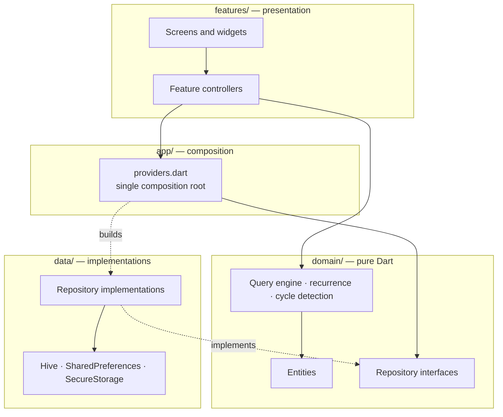
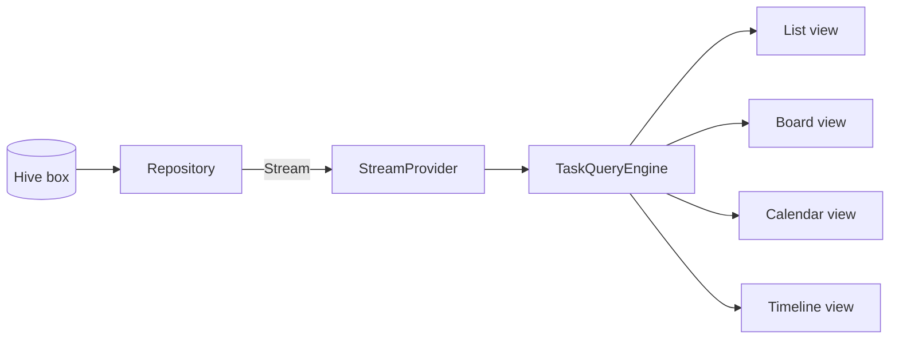

# Kairo

**A task management application built in Flutter, structured as a production codebase rather than a UI demo.**

Kairo is a multi-platform task manager — list, board, calendar and timeline views, a focus timer, and a productivity dashboard — built to explore how far a Flutter application can be taken in terms of **architecture, layering, testability and responsive correctness**.

> **Read this first:** Kairo runs entirely on-device. There is **no backend, no API and no remote database**. The data layer is a set of repository interfaces implemented against local storage, designed so a network implementation could be substituted without touching the UI. Everything below is written to that standard of accuracy — see [Known Limitations](#known-limitations) for the full list of what is not built.

| | |
|---|---|
| **Type** | Cross-platform application (portfolio / architecture study) |
| **Stack** | Flutter · Dart · Riverpod · go_router · Hive |
| **Platforms configured** | Android, iOS, Web, Windows, macOS, Linux |
| **Scale** | 120 Dart files · ~37,500 lines (excl. generated localisation) |
| **Tests** | 201 passing · ~3,000 lines of test code |
| **Static analysis** | `flutter analyze` clean under a strict ruleset |
| **Backend** | None — local-first by design |
| **Licence** | MIT |

---

## Overview

**The problem.** Task managers fragment a plan across tools: the list, the board, the calendar and the roadmap end up as separate products with separate state. Switching views loses your filters, your grouping and your place.

**The approach.** Kairo treats the four views as *renderings of one query*. Filters, sorting and grouping live in a single domain-layer query engine; every view reads the same filtered result. Switching from list to board keeps everything, because the view is a presentation choice rather than a different screen.

**Why it was built.** As a deliberate exercise in application architecture — dependency inversion, layer boundaries, and a test strategy that catches real defects rather than restating the implementation. The feature set is broad on purpose: architecture only proves itself under enough surface area to strain it.

---

## Why this project is interesting

Six things here are unusual for a Flutter portfolio project, and each is verifiable in the code:

**1. Layout correctness is enforced by tests, not by eye.**
`test/responsive/overflow_matrix_test.dart` renders **every route at nine device sizes in both themes**, installs a custom `FlutterError.onError` collector, and fails on any `RenderFlex` overflow or unbounded-constraint error — attributing each failure to the exact source line. A second matrix opens every sheet and dialog **with the keyboard raised** (`viewInsets.bottom`, the real signal a device sends). This turned "the app looks fine" into a measurable property.

**2. The tests found bugs the eye did not.**
The matrix initially reported **716 layout errors** across the app. Fixing them was an architectural exercise, not a padding exercise — see [Engineering Challenges](#engineering-challenges).

**3. A single composition root with exactly three seams.**
`lib/app/providers.dart` builds the entire object graph. Only three providers are ever overridden — environment, document store, settings store. Tests substitute those three and exercise the *real* repositories, the real query engine and the real widgets. There are no mocks of internal code.

**4. Domain logic that isn't CRUD.**
Dependency-cycle detection (`wouldCreateCycle`), blocked-task resolution, recurrence-rule expansion, and a filter/sort/group engine — all in `lib/domain/`, all pure Dart, all unit-testable without Flutter.

**5. Charts and the brand mark are hand-painted.**
14 `CustomPainter` implementations — line/area with monotone cubic interpolation, bars, donut, sparkline, gauge, heatmap, the Gantt grid and the logo. No charting dependency.

**6. Errors are values.**
A sealed `Failure` hierarchy crosses the layer boundary; mapping a failure to human text happens only in the presentation layer. Application services take `AppL10n`, never `BuildContext` — passing a context into async code invites use-after-dispose bugs.

---

## Screens

Captured on an Android device.

| Splash | Dashboard |
|---|---|
|  |  |
| Animated entrance that gates on real initialisation | Productivity score, metric tiles with sparklines, derived insights |

| Kanban board | Calendar |
|---|---|
|  |  |
| Full-height columns, horizontal scroll, lazily built cards | Month grid degrades to density dots; agenda stacks beneath |

The calendar screenshot is worth a second look: on a phone the month grid cannot show task titles, so it shows priority-coloured dots and moves the titles into an agenda below the grid. The toolbar splits onto two rows. That is a deliberate layout change per breakpoint, not a scaled-down desktop view.

Further screenshots (sign-in, additional views) are in [`pic/`](pic/).

---

## Architecture

Four layers with a strict dependency direction. `domain` depends on nothing — not even Flutter; `data` implements `domain`; `features` depend on `domain` abstractions and never on `data`. All four directions are asserted by grep in the audit, not assumed.



The dotted edges are the inversion: `features` resolve repositories through `domain` interfaces, and the composition root is the only place that knows a concrete implementation exists. Swapping local storage for HTTP means writing new classes in `data/` and changing one file.

### Data flow

Repositories expose `Stream`s. Riverpod providers turn those into reactive state; widgets watch the narrowest slice they need.



One filtered result feeds all four views — which is what makes switching views preserve state.

---

## Architecture decisions

Each of these is a real trade-off made in this codebase.

### Local-first repositories behind domain interfaces

- **Decision** — Define repository contracts in `domain/`, implement them against Hive and `SharedPreferences` in `data/`. No HTTP client anywhere.
- **Why** — A backend would have consumed the project's time budget on infrastructure rather than architecture, and a fake HTTP layer proves nothing. Local storage is a *real* implementation of a real contract.
- **Trade-off** — The project cannot demonstrate API integration, auth tokens against a real identity provider, or server-side concerns. It gains a fully deterministic, offline, instantly runnable demo.
- **Result** — Eleven repository interfaces with a substitutable implementation, and a test suite that runs the real data layer with an in-memory store.

### Storage split by data shape, not convenience

- **Decision** — Three stores: Hive for the workspace document graph, `SharedPreferences` for settings, `flutter_secure_storage` for the session token.
- **Why** — The document graph is large and rewritten in bulk; settings are small scalars read on every frame. Putting a theme flag in Hive would mean rewriting a document to toggle dark mode.
- **Trade-off** — Three stores to open at startup instead of one.
- **Result** — Credential material lives outside the document store, so a workspace export can never contain it.

### The splash screen owns startup

- **Decision** — `bootstrap()` does only what the first frame needs (open stores). Loading the workspace and restoring the session run in `startupProvider` behind an animated splash, which then routes.
- **Why** — Doing all async work before `runApp` leaves the platform holding a blank window for the duration.
- **Trade-off** — Startup routing logic lives in a provider rather than in `main()`, which is less obvious to a newcomer.
- **Result** — The first frame is branded rather than blank. The splash never pads its own runtime — it leaves the moment initialisation resolves, waiting only for the entrance animation so the logo doesn't vanish mid-fade.

### One redirect owns navigation authority

- **Decision** — A single `redirect` in `app_router.dart` decides which zone you belong in. No screen calls `go()` to enforce access.
- **Why** — Guard logic scattered across screens produces redirect loops that are very hard to reason about.
- **Trade-off** — The redirect must be exhaustive; a route missing from it is a silent hole. *This bit back — see [Known Limitations](#known-limitations).*
- **Result** — Sign-in and sign-out re-evaluate the guard automatically via `refreshListenable`.

### Design tokens as a `ThemeExtension`

- **Decision** — 38 semantic colour tokens in a `ThemeExtension`, with every Material component themed once.
- **Why** — Ad-hoc colours are how a design system dies at the twelfth screen.
- **Trade-off** — More indirection; you cannot read a hex value at the call site.
- **Result** — Dark mode is a designed palette rather than an inversion, and it is covered by the responsive matrix in both themes.

---

## Project structure

```
lib/
├── app/            Composition root, startup, root widget
│   ├── providers.dart      The entire object graph — 3 overridable seams
│   ├── bootstrap.dart      Critical startup only
│   ├── startup.dart        Deferred startup + first routing decision
│   └── session.dart        Cross-feature application state
│
├── core/           Framework-level, feature-agnostic
│   ├── theme/              Palette, design tokens, typography, icon facade
│   ├── responsive/         Breakpoints, ResponsiveBuilder, AdaptiveCardGrid
│   ├── routing/            Route table and router
│   ├── error/              Sealed Failure hierarchy + message mapping
│   ├── motion/             MotionScope — honours reduce-motion everywhere
│   ├── widgets/            Design system incl. hand-painted charts
│   └── utils/              Validators, debouncer, fuzzy match, dates
│
├── domain/         Pure Dart — no Flutter import
│   ├── entities/           24 immutable model classes across 12 files
│   ├── repositories/       11 interfaces
│   └── services/           Query engine, cycle detection, recurrence
│
├── data/           Implementations
│   ├── local/              Hive / SharedPreferences / SecureStorage
│   ├── repositories/       Repository implementations
│   └── seed/               Deterministic demo workspace
│
├── features/       Feature-first: tasks, projects, calendar, timeline,
│                   focus, analytics, dashboard, search, settings, auth,
│                   splash, shell, command palette, notifications
└── l10n/           ARB source + generated accessors
```

Features never import each other's internals. Shared behaviour is promoted to `core/` or `domain/`.

---

## Data and persistence

There is no backend. This section describes what actually exists.

| Concern | Implementation |
|---|---|
| Document graph | Hive box, JSON-encoded values, in-memory reactive `ValueStream` per collection |
| Settings | `SharedPreferences`, JSON-serialised preferences object |
| Session token | `flutter_secure_storage` (platform keychain), with an in-memory fallback |
| Demo data | Deterministic seed generated relative to `DateTime.now()` so it never ages |
| Write strategy | Debounced batch writes; flushed on app pause via a lifecycle observer |
| Failure handling | Storage failures degrade to an in-memory store rather than crashing |

**Authentication is a local demo, not an identity system.** Passwords are salted and hashed with SHA-256 before storage, and credential material is kept out of the document store. But SHA-256 is a *hash*, not a password KDF — there is no key stretching (bcrypt/scrypt/Argon2). The seeded demo account has a published password, and seeded teammate accounts accept any password of eight characters or more so the demo can be explored from another person's seat. These are deliberate demo affordances, documented in the code, and they would be unacceptable in production.

Google and Apple sign-in buttons are present in the UI and **explicitly report themselves as unavailable when pressed** — wiring them requires OAuth client IDs, which are deployment configuration rather than something to fake.

---

## Security practices

What is actually implemented:

- **No secrets in the repository.** Configuration is compile-time via `--dart-define`; `.env.example` documents every variable with defaults and states which values may legitimately live on a client.
- **Session token in the platform keychain** via `flutter_secure_storage`, never in plain preferences.
- **Credential material segregated** from the exportable document store.
- **Input validation** on every form, with a shared validator set.
- **Release builds** enable R8 minification and resource shrinking with rules in `android/app/proguard-rules.pro`.

Not claimed: this application has not undergone security review, has no threat model, and its authentication is demo-grade as described above.

---

## Testing

209 tests pass. `flutter analyze` reports no issues across `lib/`, `test/` and `integration_test/`.

| Suite | What it covers |
|---|---|
| `test/domain/` | Query engine (filter/sort/group), recurrence expansion, fuzzy matching |
| `test/data/` | Task repository behaviour, auth, analytics derivation |
| `test/widget/` | Task flows, theming, focus and projects, design-system components |
| `test/responsive/overflow_matrix_test.dart` | Every route × 9 device sizes × light/dark; board, calendar and timeline views |
| `test/responsive/overlay_matrix_test.dart` | Every sheet and dialog at 5 phone sizes **with the keyboard raised**, plus an end-to-end task creation |
| `test/app/startup_test.dart` | Startup routing contract |
| `integration_test/` | 4 end-to-end journeys, verified on Windows desktop |

**Test design.** `test/support/test_harness.dart` builds the production provider graph with three substitutions: an in-memory document store, zero simulated latency, and mocked `SharedPreferences`. Nothing internal is mocked — tests exercise real repositories, the real query engine and real widgets.

The harness deliberately does **not** override `MediaQuery.size`. A widget told it has 1400px while laying out in an 800px surface will not overflow, and the test would be lying about the environment; tests size the real test surface instead.

**Gaps, stated plainly:** there is no coverage measurement, no golden/screenshot tests, and no performance regression tests. The integration suite is the least reliable part — one run in three has produced a spurious tap-miss failure that passes on re-run.

---

## Performance work

Practices actually applied. **No benchmarks were run, and no frame-timing or FPS figures are claimed.**

- **Narrowed provider subscriptions.** `MaterialApp.router` previously watched the whole preferences object, so collapsing the sidebar rebuilt every route below it. It now watches a three-field record via `.select`.
- **Derived state moved out of `build`.** The dashboard filtered, sorted and mapped the task list inside `build` — re-running on every breakpoint change, i.e. every frame of a window drag. It is now a memoised provider.
- **Lazy list construction.** Kanban columns build cards through `ListView.builder`; previously all five columns built every card in the workspace, each with its own gesture recogniser.
- **Repaint isolation.** `RepaintBoundary` around the line chart, sparkline and donut so their animations do not dirty the surrounding panel.
- **Gradient shaders over `BackdropFilter`.** The splash glow is a radial shader; a blur would force a save-layer on the app's first frames. There is no `BackdropFilter` in the codebase.
- **Animation gating.** Continuous animations only mount when visible and when reduce-motion is off.
- **Icon tree-shaking** reduces the bundled icon font by ~96% in Android release builds.

---

## UX, accessibility and internationalisation

- **Four breakpoints** (compact / medium / expanded / large) expressed as *layout intents*, not device names, via a shared `Breakpoints` and `ResponsiveBuilder`.
- **`AdaptiveCardGrid`** replaced `GridView`'s `childAspectRatio` across dashboards and pricing. Aspect ratio makes a cell's height a function of its width — precisely the wrong dependency for content-sized cards, and the cause of a whole class of vertical overflows.
- **Reduce-motion** is honoured through a single `MotionScope` that combines the platform flag with an in-app preference; every animation reads it.
- **Touch targets** grow to a 44px hit area on touch-first breakpoints while the visual size stays 34px.
- **Designed empty, loading, and error states** — skeletons rather than spinners; empty states name the specific emptiness and offer one action.
- **Semantics** on interactive components; status and priority are conveyed by distinct icons as well as colour, so meaning survives greyscale.
- **Localisation** is ARB-driven with 411 keys and generated accessors. **English only.** Direction-aware widgets (`AlignmentDirectional`, `BorderDirectional`) are used, but no RTL locale ships and RTL has not been tested — do not read this as RTL support.

---

## Setup

**Prerequisites:** Flutter 3.38+ / Dart 3.10+. Android Studio or Xcode for mobile targets.

```bash
flutter pub get
```

```bash
flutter run -d chrome
```

The app opens on the splash, initialises, and lands on the sign-in screen. Sign in with **`demo@kairo.app` / `demo1234`**, or press **Open** on the demo banner.

No environment configuration is required to run the project — every variable has a working default.

### Environment variables

Flutter has no runtime `.env`; configuration is compile-time via `--dart-define`. [`.env.example`](.env.example) documents the full set:

```env
KAIRO_FLAVOR=development
KAIRO_API_BASE_URL=https://api.kairo.app/v1
KAIRO_USE_MOCK_DATA=true
KAIRO_MOCK_LATENCY_MS=0
KAIRO_ENABLE_ANALYTICS=false
KAIRO_STRIPE_PUBLISHABLE_KEY=pk_test_your_key_here
```

`KAIRO_API_BASE_URL` and the Stripe key are consumed by the configuration layer but **no code currently calls a network endpoint** — they exist so a future backend has a defined seam.

### Tests

```bash
flutter test
```

```bash
flutter test integration_test -d windows
```

### Builds

```bash
flutter build apk --release --split-per-abi
```

Verified locally: web and Android release builds succeed with no warnings. A fat APK measures 58.7 MB; `--split-per-abi` produces 19.4 / 21.4 / 22.8 MB per architecture. iOS is configured but **has not been built** — no macOS machine was available.

---

## Engineering challenges

### Every screen overflowed on a phone, and nobody could see it

- **Problem** — The app looked correct on a development-sized window. On a phone it was full of `RenderFlex` overflows.
- **Investigation** — Rather than fixing screens by eye, I built a test that renders every route at nine device sizes and installs a `FlutterError.onError` collector that captures overflow errors *and the source line Flutter blames*. The first run produced **716 layout errors across 29 distinct source locations**, ranked by frequency.
- **Solution** — The ranking showed these were a handful of root causes, not 716 bugs: unwrapped `Text` inside fixed `Row`s; `GridView` aspect ratios deciding card heights; toolbars holding more controls than a 320px row fits; a month grid whose height was a function of its width. Fixes went into the layout architecture — a reusable `AdaptiveCardGrid`, a segmented control that scrolls instead of being crushed, a calendar that changes representation per breakpoint.
- **Trade-off** — The matrix adds ~25 seconds to the suite and required restructuring the harness (`TestHarness.create` must run in `setUp`, because `testWidgets` bodies run against a faked clock where real futures never resolve).
- **Outcome** — 716 → 0, enforced on every run. Coverage later extended to board, calendar and timeline views, which the first matrix never reached because the task screen defaults to the list.

### "Adding a task crashes the app" — and it was not an overflow

- **Problem** — Reported from a physical device: creating a task produced an error and the app appeared to close. The route matrix was clean.
- **Investigation** — The matrix rendered *routes*; it never opened a sheet or raised a keyboard. I wrote a second matrix that opens overlays through the UI and then sets `viewInsets.bottom` — the exact signal a keyboard sends. It reproduced immediately, reporting *"A RenderFlex overflowed by 99,492 pixels"*. That magnitude is not a layout mistake, so I dumped the full `FlutterErrorDetails` rather than trusting the headline.
- **Root cause** — `No Overlay widget found.` The toast host is mounted above the router so toasts survive navigation — which also places it outside the Navigator, the only `Overlay` in the tree. The toast's close-button `Tooltip` asserted during build, its subtree was never laid out, and the six-figure "overflow" was the wreckage. It affected **every toast on every platform**.
- **Solution** — Toasts now live in their own `Overlay`. Separately, the expanding bottom sheet was sizing itself as a fraction of the *full screen*, so `initialSize: 0.9` produced a sheet taller than the visible area and laid the submit button under the keyboard — measured ~200px below the fold on all five phone sizes. The keyboard inset is now subtracted before the fractions apply.
- **Outcome** — 40 overlay tests, including one that types a title, taps **New task**, and asserts the task is created *and* the button sits above the keyboard. That test failed before the fix and passes now, which is how I know the fix is real rather than merely quieter.

### Lazy animation controllers crashing in `dispose()`

- **Problem** — Intermittent *"Looking up a deactivated widget's ancestor is unsafe"*.
- **Investigation** — `late final AnimationController` fields were only touched inside `build`, which returns early under reduced motion. The controller was therefore first *constructed* inside `dispose()`, attaching a ticker to a dead element.
- **Solution** — Create eagerly; start and stop in `didChangeDependencies`. Fixed in three widgets.
- **Outcome** — A general lesson applied across the codebase: `late final` plus a conditional `build` is a lifecycle trap.

---

## Known limitations

Stated in full. No known user-facing defect is outstanding.

**Scope**

1. No backend, API, or remote database. No multi-device sync; data is local to one install.
2. Authentication is demo-grade — SHA-256 without key stretching, a published demo password, and seeded accounts that accept any 8-character password.
3. Social sign-in is UI only (and says so when pressed).
4. There is no marketing site, pricing page or onboarding flow. Those screens existed, were left unreachable by a refactor, and were deleted in the cleanup rather than left as dead code.

**Engineering infrastructure**

5. **No CI.** No `.github/workflows`; analyze, test and build are run manually. This is the largest remaining gap.
6. No crash reporting, analytics or observability.
7. No test coverage measurement, no golden tests, no performance regression tests.
8. **Localisation is partial.** 411 strings go through ARB, but roughly 58 user-facing strings outside the demo seed are still hardcoded in widgets. With one shipping locale this changes nothing observable, which is exactly why it went unnoticed.
9. English only; direction-aware widgets are used but RTL is untested.
10. Android release builds are signed with the debug keystore so a clean checkout builds. A real release needs a keystore supplied through an uncommitted `key.properties`.
11. iOS is configured but never built — no macOS machine available.
12. `compileSdk` is pinned to 36 and `flutter_secure_storage` held at 9.x because API 37 is still a preview on the development machine.

---

## Future improvements

Ordered by what the current architecture makes cheapest:

1. **Add CI** — a workflow running `flutter analyze`, `flutter test` and the release builds is the single highest-value addition, and the one thing that would have caught the dead-route regression before a user did.
2. **Finish the localisation pass** — move the remaining hardcoded strings into ARB, then add a second locale to prove the pipeline.
3. **Add an HTTP repository implementation** — the interfaces and the composition root already make this a `data/` change plus one override.
4. **Move authentication to a real identity provider** rather than strengthening the local hash, which would still be client-side.
5. **Coverage measurement and golden tests** to complement the layout matrices.
6. **A second, RTL locale** to convert "direction-aware" into demonstrated RTL support.

---

## Technology stack

| Category | Technology |
|---|---|
| Framework | Flutter (Material 3), Dart |
| State management | Riverpod 3 — `Notifier`, `StreamProvider`, `.family`, `.select` |
| Navigation | go_router 17 — `ShellRoute`, redirect guards, query-param overlays |
| Local persistence | Hive · `shared_preferences` · `flutter_secure_storage` |
| Localisation | ARB + `flutter gen-l10n` |
| Visualisation | Hand-written `CustomPainter` (no chart library) |
| Testing | `flutter_test`, `integration_test`, `fake_async` |
| Tooling | `flutter_lints` + a strict custom ruleset, `dart format` |
| Backend / CI | **None** |

**Dependency posture.** Twelve third-party packages plus the two Flutter SDK entries. Each was checked against actual imports before being kept. Charts, the design system, markdown rendering, the animation system and fuzzy search are implemented rather than imported.

---

## Code quality

The analyser is configured to treat maintenance problems as build failures rather than suggestions:

```yaml
errors:
  unused_import: error
  unused_local_variable: error
  unused_element: error
  dead_code: error
language:
  strict-casts: true
  strict-raw-types: true
```

Plus 36 explicit lint rules including `always_declare_return_types`, `prefer_const_constructors`, `directives_ordering`, `require_trailing_commas` and `use_build_context_synchronously`. `flutter analyze` is clean, and the codebase is `dart format` clean.

Comments explain *why*, not *what* — most non-obvious decisions carry the reasoning and the trade-off inline.

---

## What this project demonstrates

Each claim maps to something inspectable:

| Capability | Evidence |
|---|---|
| Layered architecture and dependency inversion | `domain/` imports no Flutter and no `data/`; `features/` never import `data/` |
| Composition-root design | `app/providers.dart` — whole graph, three seams |
| State management at scale | Riverpod across 14 features, with `.select` used to bound rebuilds |
| Non-trivial domain logic | Cycle detection, recurrence expansion, query engine — all unit-tested |
| Test strategy that finds real defects | 716 → 0 layout errors; a device-reported crash reproduced in a test first |
| Debugging methodology | Reading full `FlutterErrorDetails` rather than the headline found a `Tooltip`/`Overlay` bug disguised as an overflow |
| Responsive engineering | Per-breakpoint layout changes, verified across nine sizes |
| Design-system thinking | `ThemeExtension` tokens, one button, one segmented control |
| Custom rendering | 14 `CustomPainter` implementations |
| Honest scoping | Non-functional affordances say so; limitations documented rather than hidden |

**What it does not demonstrate:** backend development, API integration, database design, DevOps or CI/CD, or team collaboration workflow. Those are absent, and the sections above say so rather than implying otherwise.

---

## Author

**Saad** — software engineer working in Flutter and application architecture.

This repository is a portfolio project. It is offered as evidence of how I structure an application, reason about trade-offs, and test what I build — not as a shipped product. The [Known Limitations](#known-limitations) section is deliberately as detailed as the rest of this document; I would rather a reviewer find the weaknesses listed than discover them unlisted.

---

## Licence

MIT — see [LICENSE](LICENSE).
